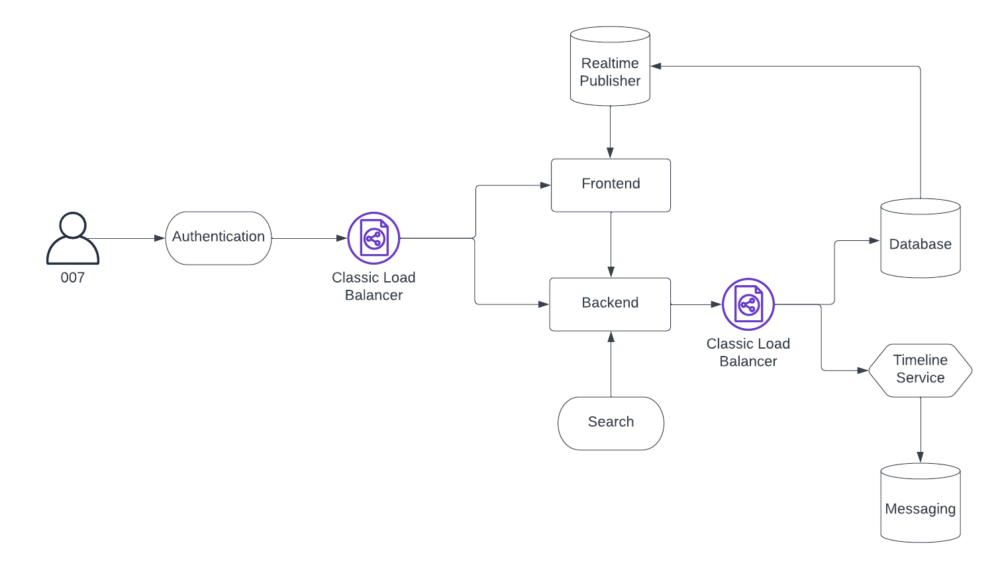

# Week 0 — Billing and Architecture

## Homework Assignments

### Install AWS CLI

- Used Gitpod to install AWS CLI. The .yml file is updated.
- Generated AWS access creds for the new user and set them up as env vars in Gitpod.

### Setup AWS Budget
Newly created accound did not have access to billing data. So created IAM policies that grant permissions to billing data using [these instructions](https://docs.aws.amazon.com/IAM/latest/UserGuide/tutorial_billing.html?icmpid=docs_iam_console#tutorial-billing-step2)

### Setup Billing Alerts

### Logical Architecture Diagram

### Conceptual Architecture Diagram

1. In a Napkin

2. During session

